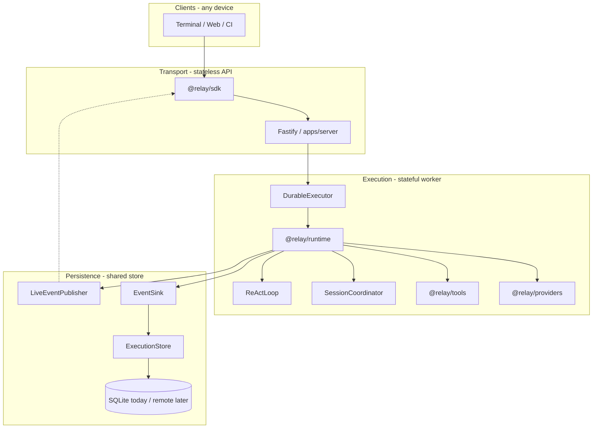

# Relay (Agent Shell)

A **local-first execution runtime** for AI agents with a terminal-native UI — event-sourced, not a chatbot wrapper. The event log is the system of record; the terminal is a disposable projection.

See [North Star](#north-star) for design intent, invariants, and the [platform seams diagram](#platform-seams).

## North Star

Relay owns agent loop state, streams events to observers, and persists an append-only record — with every boundary defined as a **swappable seam** (local adapters today, remote adapters later).

**What it is:** The thing that owns execution state, drives the agent loop, and lets clients observe without depending on them.

**The core insight:** The agent loop (ReAct), persistence, and client transport are three separate concerns. Relay keeps them explicitly separated from day one.

**The design rule:**

> The runtime runs. Clients watch. Storage records. None of them need each other to function.

**Invariants** (enforced in code and tested):

| Invariant | Meaning |
|-----------|---------|
| UI refresh never interrupts execution | Runtime server is a separate process; the terminal is a disposable subscriber |
| Storage never blocks token streaming | Events fan out to observers first; persistence runs asynchronously via `EventSink` |
| Client disconnect never cancels the agent | SSE `close` unsubscribes the observer only — execution continues |

**Seams** — see [What is a seam?](#what-is-a-seam) below. Interfaces live in `@relay/types/seams` and `@relay/types/storage`; local adapters in `@relay/runtime/seams/local` and `@relay/storage`.

### What is a seam?

A **seam** is a boundary where one part of the system ends and another begins — defined by an **interface**, not a concrete implementation. The runtime depends on `EventSink.write()`, not on SQLite. The server depends on `DurableExecutor.execute()`, not on whether the loop runs in-process or on a remote worker.

That lets you **swap adapters** without rewriting the ReAct loop:

| Seam | Interface | Local adapter (today) |
|------|-----------|----------------------|
| Durability | `EventSink` | `createProjectorEventSink()` → SQLite |
| Dispatch | `DurableExecutor` | `createLocalDurableExecutor()` → in-process |
| Session ownership | `SessionCoordinator` | `createLocalSessionCoordinator()` → in-memory |
| Live observers | `LiveEventPublisher` | `createLocalLiveEventPublisher()` → EventEmitter |

Other swappable boundaries (`ExecutionStore`, `ExecutionLoop`, …) follow the same pattern — interface in `@relay/types`, adapter in `@relay/storage` or `@relay/runtime`.

### Platform seams

Local today = **one Bun process** (`apps/server`). Seam **interfaces** are shared; **local adapters** (`createLocal*`) are wired in-process. Distributed deployment swaps adapters — gateway, workers, Redis, remote store — not the loop.



| Layer | Interface | Local adapter (today) | Remote adapter (future) |
|-------|-----------|----------------------|-------------------------|
| Observer | `@relay/sdk` | Terminal | Web, mobile, CI |
| Transport | `apps/server` | Fastify on localhost | `apps/gateway` |
| Dispatch | `DurableExecutor` | `createLocalDurableExecutor` | `createQueueDurableExecutor` |
| Coordination | `SessionCoordinator` | `createLocalSessionCoordinator` | `createRedisSessionCoordinator` |
| Live fanout | `LiveEventPublisher` | `createLocalLiveEventPublisher` | `createRedisLiveEventPublisher` |
| Execution | `@relay/runtime` | ReAct loop in-process | Same loop on worker pod |
| Durability | `EventSink` | `createProjectorEventSink` (SQLite) | Remote append-only log |

## Contents

- [Quick Start](#quick-start)
- [North Star](#north-star) — design intent, invariants, platform seams diagram
- [Architecture](#architecture)
- [Relay SDK](#relay-sdk-relaysdk)
- [Event Sourcing](#event-sourcing)
- [Storage](#storage)
- [Runtime API](#runtime-api)
- [Monorepo](#monorepo)
- [Security](#security)
- [Development](#development)
- [Troubleshooting](#troubleshooting)
- [Performance Philosophy](#performance-philosophy)

## Quick Start

**Prerequisites:** [Bun](https://bun.sh) 1.3+, Node 24.16+

```bash
# Install dependencies
bun install

# Configure environment (must live at monorepo root)
cp .env.example .env
# Edit .env and set GEMINI_API_KEY
```

Run the runtime and UI in **two terminals** (recommended):

```bash
# Terminal 1 — runtime server (loads .env, watches for changes)
bun run dev:server

# Terminal 2 — Ink UI (needs a real TTY for keyboard input)
bun run dev:terminal
```

| Script | What it runs |
|--------|----------------|
| `bun run dev:server` | Fastify runtime at `http://127.0.0.1:4310` |
| `bun run dev:terminal` | Ink chat UI (connects via `@relay/sdk`) |
| `bun run dev` | Both via Turborepo — terminal input may not work; prefer two terminals |

Type a prompt and press Enter. Follow-up messages continue the same conversation (full history is sent to the model). Use **/** for a command palette (`/model`, `/trace`, `/metrics`, `/new`, `/help`). Press **Tab** or **⌘O** (Ctrl+O on Linux) to open the model picker. If the agent is still replying, your next message is **queued** and shown above the input bar until it sends. Tool activity appears inline under your message; open **/trace** or **/metrics** for full detail in overlay panels above the input. Press **Esc** to close overlays, then exit; **Ctrl+C** quits immediately.

### Terminal controls

| Key | Action |
|-----|--------|
| Enter | Send prompt (works with trace/metrics overlays open) |
| `/` | Slash command palette — `/model`, `/trace`, `/metrics`, `/theme`, `/new`, `/help` |
| Tab / ⌘O (Ctrl+O) | Open model picker overlay |
| ↑↓ | Navigate slash palette or model list |
| ←→ | Switch provider tab (model picker) |
| `]` / `[` | Expand / collapse focused trace item (trace overlay) |
| ⌘⇧T / ⌘⇧M | Toggle trace / metrics overlay |
| Esc | Close top overlay, or exit when none open |
| Ctrl+C | Exit terminal (server keeps running) |

### Multi-turn conversations

The terminal keeps one **session** alive across prompts. The first message calls `POST /sessions`; follow-ups call `POST /sessions/:id/messages`, which loads the latest checkpoint and appends your new user message to the ReAct loop history.

Use **`/new`** to clear the UI, cancel any in-flight work on the current session, and start a fresh session on the next send. Model and theme preferences are preserved.

While the agent is thinking, streaming, or running tools, additional prompts are **queued** (highlighted above the input) and sent automatically when the current turn finishes.

**Token cost grows with history** — Each follow-up reloads the latest checkpoint and sends the full conversation (system prompt, tools, and all prior user/assistant/tool messages) to the model. Input tokens and cost per turn increase as the thread gets longer; header metrics show cumulative session spend. Use `/new` when you no longer need prior context.

### Replay a previous session

```bash
bun run apps/terminal/src/index.tsx --session <session-id>
```

### Resume from a checkpoint

After a failed or cancelled run, re-execute from the last saved checkpoint (or a specific one):

```bash
# List checkpoints for a session
curl http://127.0.0.1:4310/sessions/<session-id>/checkpoints

# Resume from latest checkpoint (same session id)
curl -X POST http://127.0.0.1:4310/sessions/<session-id>/rerun

# Resume from a specific checkpoint
curl -X POST http://127.0.0.1:4310/sessions/<session-id>/rerun \
  -H 'Content-Type: application/json' \
  -d '{"checkpointId":"<checkpoint-id>"}'
```

Then attach with the terminal replay command above, or use `client.rerun()` + `client.subscribe()` from the SDK.

### Continue a conversation (follow-up message)

Send another user message on an existing session without starting over:

```bash
curl -X POST http://127.0.0.1:4310/sessions/<session-id>/messages \
  -H 'Content-Type: application/json' \
  -d '{"prompt":"What did I just ask?"}'
```

The runtime restores the latest checkpoint, appends the new user message, and runs the ReAct loop with full prior context. Returns `{ sessionId }` (same id).

## Architecture

**Two processes** for daily use — runtime server + disposable terminal. **One process** inside the server today: Fastify, local seam adapters, and `@relay/runtime` all run together. See [Platform seams](#platform-seams) for the distributed target.

```
┌─────────────────────────────────────────────────────────────┐
│                     Process 2: Terminal                      │
│  Ink UI (apps/terminal)  ── @relay/sdk (HTTP + SSE) ───────┼──┐
└─────────────────────────────────────────────────────────────┘  │
                          localhost only                           │
┌─────────────────────────────────────────────────────────────┐  │
│              Process 1: Runtime Server (apps/server)         │◄─┘
│                                                              │
│  Fastify ──► DurableExecutor ──► @relay/runtime (ReActLoop) │
│                  │                    │                      │
│                  │         SessionCoordinator (local adapter)  │
│                  │         LiveEventPublisher (local adapter)  │
│                  │         EventSink (local adapter) ──► SQLite │
│                  └── providers (Gemini) · tools (local FS)  │
└─────────────────────────────────────────────────────────────┘
```

### Two-process model

| Process | Role | Survives UI exit? |
|---------|------|-------------------|
| Runtime server | Source of truth, executes agent loop, persists events | Yes |
| Ink terminal | Stateless event subscriber, renders projections | Disposable |

Multiple terminals can attach to the same runtime simultaneously. Restarting the UI reconnects via SSE with `Last-Event-ID` support.

**Client vs server:** Anything that renders UI or tooling talks to the runtime through [`@relay/sdk`](#relay-sdk-relaysdk). The server owns execution, persistence, and secrets. Clients only project events.

## Relay SDK (`@relay/sdk`)

Relay's architecture hinges on a hard line between **execution** (server) and **projection** (anything that renders). `@relay/sdk` is that line — a small, dependency-light client that speaks HTTP + SSE to the runtime and nothing else.

The Ink terminal (`apps/terminal`) is the first consumer, but it is intentionally **not special**. It imports only `@relay/sdk` and `@relay/types` (via event payloads). It never touches `@relay/runtime`, `@relay/storage`, or provider code. Swap the terminal for a TUI written in Python, a browser dashboard, or a headless log tailer — as long as it uses the SDK, it gets the same typed event stream.

```
┌──────────────────┐     send()        POST /sessions
│  Your client     │ ─────────────────►  starts execution
│  (terminal,      │     send({ sessionId })  POST /sessions/:id/messages
│   script, web)   │ ─────────────────►  continue conversation
│                  │
│                  │     subscribe()   GET /sessions/:id/events  (SSE, live)
│                  │ ◄─────────────────  token.streamed, tool.*, cost.updated, …
│                  │
│                  │     replay()      GET /sessions/:id/replay   (SSE, read-only)
│                  │ ◄─────────────────  full history from SQLite
│                  │
│                  │     rerun()         POST /sessions/:id/rerun
│                  │ ─────────────────►  resume execution from checkpoint
│                  │
│                  │     listCheckpoints() GET /sessions/:id/checkpoints
└──────────────────┘
         │
         └── createClient() — fetch + SSE parser, auto-reconnect, Last-Event-ID
```

### API surface

| Method | HTTP | Purpose |
|--------|------|---------|
| `send({ prompt, model? })` | `POST /sessions` | Start a new agent session; returns `{ sessionId }` |
| `send({ prompt, sessionId, model? })` | `POST /sessions/:id/messages` | Continue an existing session with a follow-up message; returns `{ sessionId }` |
| `listModels()` | `GET /models` | Provider registry + model lists (Gemini today) |
| `listCheckpoints(sessionId)` | `GET /sessions/:id/checkpoints` | Checkpoint ids, labels, and iteration numbers |
| `rerun({ sessionId, checkpointId?, model? })` | `POST /sessions/:id/rerun` | Resume execution from a checkpoint; returns `{ sessionId }` |
| `cancel(sessionId)` | `POST /sessions/:id/cancel` | Abort in-flight execution (no-op if idle) |
| `subscribe({ sessionId, onEvent, … })` | `GET /sessions/:id/events` | Live SSE stream — tokens, tools, costs, errors |
| `replay({ sessionId, onEvent, … })` | `GET /sessions/:id/replay` | Read-only replay of persisted events, then closes |

Every `onEvent` callback receives a typed `RelayEvent` from `@relay/types` — the same shape the runtime writes to SQLite. Clients **project** events into UI state; they never mutate the log.

`subscribe` tracks `Last-Event-ID` across reconnects and retries automatically. The server replays missed events on connect, so a client that attaches after execution has already started still receives the full transcript.

### Where we use it

**`apps/terminal`** — the reference client:

1. **New prompt** — `client.send()` returns a `sessionId`, then `client.subscribe()` opens the live stream. Events flow into a React reducer (`state.ts`) that builds chat messages, tool traces, and metrics.
2. **Follow-up prompts** — the terminal passes `sessionId` to `client.send()`, which calls `POST /sessions/:id/messages`. Chat history stays on screen; the model sees prior turns via the checkpoint.
3. **Message queue** — prompts sent while the agent is busy are queued above the input and auto-sent when the turn completes.
4. **Session replay** — `bun run apps/terminal/src/index.tsx --session <id>` calls `client.replay()` to rebuild history from the event log, then `subscribe()` to pick up anything still running.
5. **Checkpoint resume** — `client.rerun({ sessionId })` restores the ReAct loop from the latest `checkpoint.saved` snapshot and continues execution on the same session (after failure/cancel, not for normal chat).
6. **New conversation** — `/new` cancels in-flight work, clears the UI, and drops the session id; the next send starts fresh.
7. **Disposable UI** — closing the terminal calls the unsubscribe function; the runtime server and SQLite log keep running untouched.

The terminal does **not** load `GEMINI_API_KEY` or any server secrets — only `RELAY_URL` (optional) to find the runtime. All LLM and tool execution stays in Process 1.

### Building your own client

```typescript
import { createClient } from "@relay/sdk";
import type { RelayEvent } from "@relay/types";

const client = createClient({
  baseUrl: process.env.RELAY_URL ?? "http://localhost:4310",
});

const { sessionId } = await client.send({ prompt: "List files in this directory" });

const stop = client.subscribe({
  sessionId,
  onConnect: () => console.log("stream live"),
  onEvent: (event: RelayEvent) => {
    switch (event.type) {
      case "token.streamed":
        process.stdout.write(event.payload.token);
        break;
      case "tool.started":
        console.log(`→ ${event.payload.toolName}`);
        break;
      case "cost.updated":
        console.log(`tokens: ${event.payload.inputTokens} in / ${event.payload.outputTokens} out`);
        break;
    }
  },
  onError: (err) => console.error("stream error", err),
});

// Follow-up on the same session (model sees prior context)
await client.send({ sessionId, prompt: "Now summarize what you found" });

// Later: stop(); or attach to an existing session with replay + subscribe

const { checkpoints } = await client.listCheckpoints(sessionId);
if (checkpoints.length > 0) {
  await client.rerun({ sessionId }); // latest checkpoint
  // await client.rerun({ sessionId, checkpointId: checkpoints[0].checkpointId });
}
```

The SDK is **fetch-native** (no WebSocket library, no code generation) — it runs in Bun, Node 24+, and browsers pointed at a local runtime. If the HTTP routes don't change, every client keeps working.

Most agent frameworks couple the UI to the runtime — shared process, shared imports, shared config. Relay inverts that: the event log is canonical, the SDK is the public API, and every surface is a throwaway projection.

## Event Sourcing

Every state change is an **append-only, immutable event**:

| Field | Description |
|-------|-------------|
| `id` | ULID (sortable, unique) |
| `sessionId` | Execution container |
| `type` | Event kind |
| `timestamp` | Epoch milliseconds |
| `payload` | Typed event data |

**Event types:** `message.started`, `token.streamed`, `tool.started`, `tool.completed`, `checkpoint.saved`, `cost.updated`, `message.completed`, `error`

Session status (`idle`, `running`, `paused`, `completed`, `failed`, `cancelled`) is **derived from events only** — never stored as authoritative state.

### Replay vs rerun vs continue

| | Replay | Continue (`/messages`) | Rerun (resume) |
|---|--------|------------------------|----------------|
| **What** | Stream historical events from SQLite | Append a new user message and run the loop | Re-execute from a checkpoint |
| **Re-executes LLM?** | No | Yes | Yes |
| **New user message?** | No | Yes | No (restores mid-turn state) |
| **Use case** | UI reconnect, audit, crash recovery view | Multi-turn chat | Resume after error, cancel, or max-iterations |

**Checkpoints** are saved automatically after each tool-loop iteration (and on completion). Each `checkpoint.saved` event carries the full message history and iteration count. `continue` and `rerun` both restore from the latest checkpoint; `continue` appends a new user turn and resets the per-turn tool iteration budget, while `rerun` resumes mid-turn without re-emitting the original user message.

Replay reconstructs state **only from events**. No hidden state. Kill the server, restart it, replay a session — the transcript matches exactly.

## Storage

SQLite (via `bun:sqlite` + Drizzle ORM) is the **execution store**, not an analytics store. The server auto-creates tables on startup.

**Local only — not in git:** the database lives at `RELAY_DB_PATH` (default `./data/relay.db`). The `data/` directory and all `*.db` / WAL files are listed in `.gitignore` and are never pushed to GitHub. Each developer (and each machine) gets its own event log.

| Table | Purpose |
|-------|---------|
| `events` | Append-only source of truth |
| `sessions` | Session metadata |
| `messages` | Projection (written after `message.completed`) |
| `tool_calls` | Projection (from tool events) |
| `snapshots` | Checkpoint payloads |

Messages are never written directly by the loop or tools — only projected by the runtime after `message.completed`.

**Async persistence (`EventSink` seam):** The runtime fans out events to live observers before writing to storage. `createProjectorEventSink()` in `@relay/storage` is the local adapter — `write()` returns immediately; events persist serially on a background chain. The loop calls `flush()` when a session finishes so durability is guaranteed before the session goes idle.

## Runtime API

The server-side runtime (`@relay/runtime`) is for execution internals and contributors — not for UI clients. Use [`@relay/sdk`](#relay-sdk-relaysdk) from anything that renders or observes.

**HTTP routes** (Fastify, `apps/server`) — mutations go through `DurableExecutor`; reads and SSE use `Runtime` directly:

| Method | Path | Purpose |
|--------|------|---------|
| `POST` | `/sessions` | Start new session |
| `POST` | `/sessions/:id/messages` | Continue session with follow-up message |
| `POST` | `/sessions/:id/rerun` | Resume from checkpoint |
| `POST` | `/sessions/:id/cancel` | Cancel in-flight execution |
| `GET` | `/sessions/:id/events` | Live SSE stream |
| `GET` | `/sessions/:id/replay` | Read-only SSE replay |
| `GET` | `/sessions/:id/checkpoints` | List checkpoints |
| `GET` | `/sessions` | List sessions |
| `GET` | `/models` | Provider/model registry |
| `GET` | `/health` | Health check |

```typescript
// apps/server composition (simplified)
const executor = createLocalDurableExecutor({ runtime, coordinator, workerId });

executor.execute({ kind: "execute", prompt });           // POST /sessions
executor.execute({ kind: "continue", sessionId, prompt }); // POST /sessions/:id/messages
executor.execute({ kind: "rerun", sessionId, checkpointId }); // POST /sessions/:id/rerun
executor.cancel(sessionId);                              // POST /sessions/:id/cancel

runtime.replay({ sessionId });                           // SSE history + reconnect
runtime.onSessionEvent(sessionId, handler);            // Live SSE fanout
runtime.listCheckpoints(sessionId);
```

Local adapters live in `@relay/runtime/seams/local`: `createLocalDurableExecutor`, `createLocalSessionCoordinator`, `createLocalLiveEventPublisher`. Interfaces live in `@relay/types/seams`.

## Monorepo

```
apps/
  terminal/      ← Ink 7 CLI UI (depends only on @relay/sdk)
  server/        ← Fastify runtime server

packages/
  runtime/       ← execution engine + seams/local adapters (no HTTP)
  providers/     ← Gemini LLM adapter
  storage/       ← bun:sqlite store + local EventSink adapter
  tools/         ← file.read, shell.exec implementations
  tool-registry/ ← tool abstraction layer
  sdk/           ← runtime client (SSE transport)
  types/         ← events, storage, and seam interfaces (`seams.ts`)
```

Internal packages use the workspace protocol: `"@relay/sdk": "workspace:*"`

Turborepo manages build ordering, dev parallelization, and typechecking — not distributed execution.

## Security

Relay is a **local-first dev tool** (like Cursor or Claude Code): the agent runs on your machine with broad filesystem access by design. The runtime binds `127.0.0.1` only — not exposed to the network by default. There is no auth layer in the MVP; that is acceptable for solo local use.

- API keys and secrets stay in the server process; clients never receive them
- Tool inputs/outputs are sanitized before storage and before LLM context
- Events are safe to replay in any environment
- `file.read` blocks `.env` files and path traversal via symlinks (light guardrails, not a sandbox)
- `shell.exec` is allowlisted (`pwd`, `ls`, `cat` only) with a minimal spawn environment

## Development

```bash
bun run build       # Build all packages
bun run typecheck   # Type-check all packages
bun run test        # Invariant tests (storage, runtime, terminal reducer)
bun run dev:server  # Runtime only (direct Bun watch, loads root .env)
bun run dev:terminal # Ink UI only (direct Bun watch)
bun run dev         # Both via Turborepo (use two terminals instead for daily work)
bun run db:migrate  # Drizzle migrations (optional; server also auto-migrates)
```

### Environment variables

| Variable | Default | Description |
|----------|---------|-------------|
| `GEMINI_API_KEY` | — | Google Gemini API key (required, server only) |
| `GEMINI_MODEL` | `gemini-3.1-flash-lite` | Default Gemini model ID (server + terminal fallback) |
| `RELAY_PORT` | `4310` | Runtime server port |
| `RELAY_DB_PATH` | `./data/relay.db` | SQLite database path |
| `RELAY_URL` | `http://localhost:4310` | SDK connection URL (terminal / clients) |

`.env` must live at the **monorepo root** (`agent-shell/.env`), not inside `apps/server/`. `dev:server` loads it via `bun --env-file=.env`.

## Troubleshooting

| Issue | Fix |
|-------|-----|
| `GEMINI_API_KEY environment variable is required` | Ensure `.env` is at repo root with `GEMINI_API_KEY=...` (no spaces around `=`). Restart the server after editing. |
| `Invalid task configuration` / Turbo TUI error on `dev:server` | Use the current `dev:server` script (direct Bun, not Turbo) or upgrade/pull latest |
| Port already in use | Change `RELAY_PORT` in `.env` and set `RELAY_URL` to match |
| Can't type in terminal UI | Use `bun run dev:terminal` in its own terminal — Ink needs a direct TTY |
| Stream shows **standby** | Normal before your first prompt |
| Stream shows **disconnected** | Start runtime with `bun run dev:server` first; header status dot turns green when ready |
| Trace/metrics overlay blocks typing | Overlays stay open while you type; press Esc to dismiss |
| Queued message not sending | Wait for the current turn to finish (status shows DONE), or use `/new` to cancel and reset |

## Performance Philosophy

Relay intentionally uses **TypeScript + Bun** for the MVP runtime.

1. **LLM latency dominates** — A typical Gemini round-trip is 500ms–5s. Runtime overhead (event persistence, SSE fanout, projection) is microseconds to low milliseconds. Optimizing the runtime before measuring LLM cost is premature.

2. **Architecture clarity first** — Event sourcing, replay correctness, and provider abstraction matter more than raw throughput at MVP scale.

3. **Event sourcing is the core abstraction** — The append-only event log decouples execution from UI, storage, and transport. This boundary enables future native rewrites (Rust/Go) without changing the SDK contract.

4. **Portability** — TypeScript runs on Bun and Node 24. The runtime package has no HTTP dependency. Storage, providers, and loops are independently replaceable.

5. **Measure before refactoring** — Profile when event throughput exceeds local SQLite write capacity or SSE fanout becomes measurable.

## License

MIT
