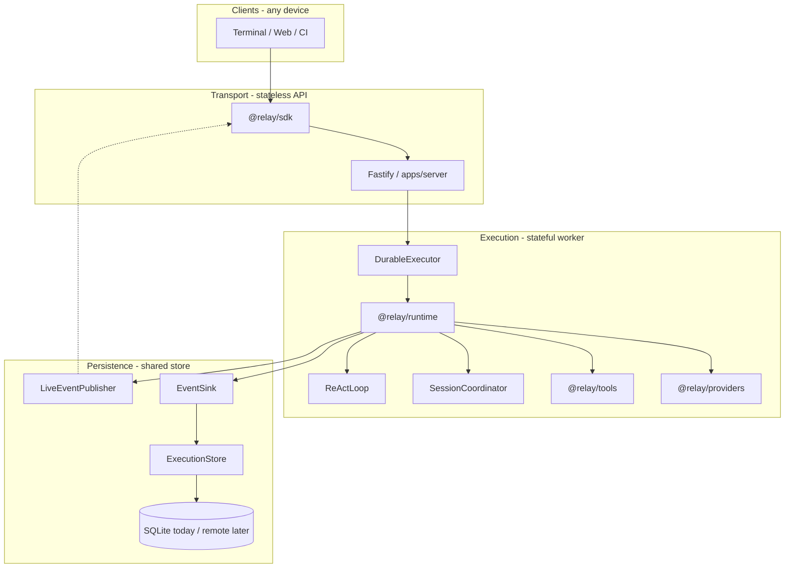

# North Star

Relay owns agent loop state, streams events to observers, and persists an append-only record — with every boundary defined as a **swappable seam** (local adapters today, remote adapters later).

**What it is:** The thing that owns execution state, drives the agent loop, and lets clients observe without depending on them.

**The core insight:** The agent loop (ReAct), persistence, and client transport are three separate concerns. Relay keeps them explicitly separated from day one.

**The design rule:**

> The runtime runs. Clients watch. Storage records. None of them need each other to function.

**Invariants** (enforced in code and tested):

| Invariant | Meaning |
|-----------|---------|
| UI refresh never interrupts execution | Runtime server is a separate process; the terminal is a disposable subscriber |
| Storage never blocks token streaming | Events fan out to observers first; persistence runs asynchronously via `EventSink` |
| Client disconnect never cancels the agent | SSE `close` unsubscribes the observer only — execution continues |

**Seams** — see [What is a seam?](#what-is-a-seam) below. Interfaces live in `@relay/types/seams` and `@relay/types/storage`; local adapters in `@relay/runtime/seams/local` and `@relay/storage`.

## What is a seam?

A **seam** is a boundary where one part of the system ends and another begins — defined by an **interface**, not a concrete implementation. The runtime depends on `EventSink.write()`, not on SQLite. The server depends on `DurableExecutor.execute()`, not on whether the loop runs in-process or on a remote worker.

That lets you **swap adapters** without rewriting the ReAct loop:

| Seam | Interface | Local adapter (today) |
|------|-----------|----------------------|
| Durability | `EventSink` | `createProjectorEventSink()` → SQLite |
| Dispatch | `DurableExecutor` | `createLocalDurableExecutor()` → in-process |
| Session ownership | `SessionCoordinator` | `createLocalSessionCoordinator()` → in-memory |
| Live observers | `LiveEventPublisher` | `createLocalLiveEventPublisher()` → EventEmitter |

Other swappable boundaries (`ExecutionStore`, `ExecutionLoop`, …) follow the same pattern — interface in `@relay/types`, adapter in `@relay/storage` or `@relay/runtime`.

## Platform seams

Local today = **one Bun process** (`apps/server`). Seam **interfaces** are shared; **local adapters** (`createLocal*`) are wired in-process. Distributed deployment swaps adapters — gateway, workers, Redis, remote store — not the loop.

| Layer | Interface | Local adapter (today) | Remote adapter (future) |
|-------|-----------|----------------------|-------------------------|
| Observer | `@relay/sdk` | Terminal | Web, mobile, CI |
| Transport | `apps/server` | Fastify on localhost | `apps/gateway` |
| Dispatch | `DurableExecutor` | `createLocalDurableExecutor` | `createQueueDurableExecutor` |
| Coordination | `SessionCoordinator` | `createLocalSessionCoordinator` | `createRedisSessionCoordinator` |
| Live fanout | `LiveEventPublisher` | `createLocalLiveEventPublisher` | `createRedisLiveEventPublisher` |
| Execution | `@relay/runtime` | ReAct loop in-process | Same loop on worker pod |
| Durability | `EventSink` | `createProjectorEventSink` (SQLite) | Remote append-only log |
